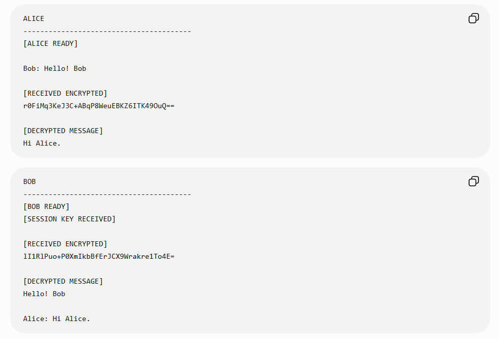
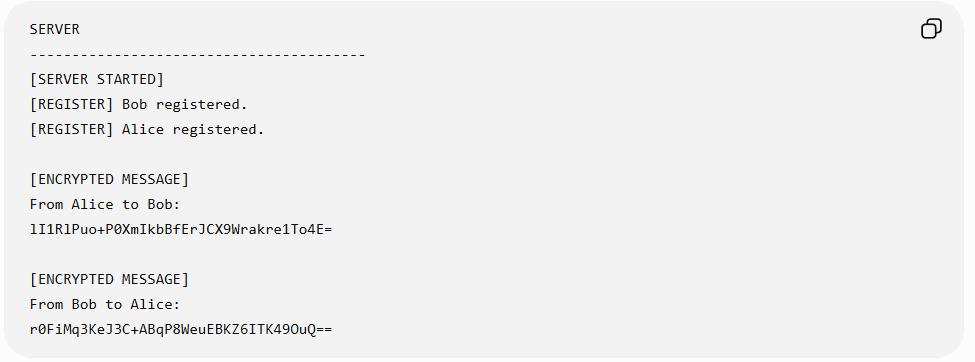

# 🔐 E2EE Chat — End-to-End Encrypted Messaging

An educational **end-to-end encrypted messaging system** built with Python that demonstrates secure communication between two clients through a relay server.

The project uses **RSA-2048 with OAEP/SHA-256** to securely exchange an **AES-256 session key**, while chat messages are encrypted using **AES-CFB**. The relay server routes encrypted data between clients without decrypting the message content.

---

## 📸 Demo

### 💬 Encrypted Client Communication



Alice and Bob exchange encrypted messages. The receiving client displays the ciphertext before decrypting the message locally.

### 🖥️ Relay Server



The relay server receives and forwards the encrypted messages between clients without decrypting their contents.

---

## ✨ Features

* 🔑 Generates a unique **RSA-2048 public/private key pair** for each client
* 🔐 Uses **RSA-OAEP with SHA-256** for secure AES session-key exchange
* 🛡️ Uses a randomly generated **256-bit AES session key**
* 💬 Encrypts chat messages using **AES-CFB**
* 🎲 Generates a random initialization vector (IV) for each encrypted message
* 📤 Routes encrypted messages through a central relay server
* 📥 Decrypts messages locally on the recipient's client
* ⌨️ Simple terminal-based messaging interface
* 🧵 Uses Python threading to receive messages while allowing user input
* 📝 Supports local message logging while keeping generated logs out of Git

---

## 🔄 How It Works

The application consists of three main participants:

```text
┌──────────────┐
│    Alice     │
│              │
│ RSA Key Pair │
│ AES-256 Key  │
└──────┬───────┘
       │
       │ RSA-encrypted
       │ AES session key
       ▼
┌──────────────────┐
│   Relay Server   │
│                  │
│ Routes encrypted │
│ data             │
└────────┬─────────┘
         │
         ▼
┌──────────────┐
│     Bob      │
│              │
│ RSA Key Pair │
│ Decrypts AES │
│ Session Key  │
└──────────────┘
```

### 🔑 1. RSA Key Generation

Each client generates a **2048-bit RSA public/private key pair**.

The private key remains with the client while the public key can be used to encrypt information intended for that client.

### 🔐 2. Session Key Exchange

Alice generates a random **32-byte (256-bit) AES session key**.

The AES key is encrypted using Bob's RSA public key with **OAEP padding and SHA-256** before being sent through the relay server.

Bob receives the encrypted session key and decrypts it using his RSA private key.

### 💬 3. Message Encryption

When Alice sends:

```text
Bob: Hello! Bob
```

the plaintext is encrypted locally using the shared AES session key.

Instead of seeing the plaintext, the server receives data similar to:

```text
lI1RlPuo+P0XmIkbBfErJCX9Wrakre1To4E=
```

### 📡 4. Server Relay

The server determines the intended recipient and forwards the encrypted data.

The server can observe routing information and ciphertext but does **not decrypt the message content**.

### 🔓 5. Client Decryption

Bob receives the ciphertext and decrypts it locally using the shared AES session key:

```text
[RECEIVED ENCRYPTED]
lI1RlPuo+P0XmIkbBfErJCX9Wrakre1To4E=

[DECRYPTED MESSAGE]
Hello! Bob
```

Bob can then send an encrypted response back to Alice using the same session key.

---

## 🛠️ Technologies

| Technology             | Purpose                         |
| ---------------------- | ------------------------------- |
| **Python**             | Core application                |
| **Python Sockets**     | TCP client-server communication |
| **Threading**          | Concurrent message receiving    |
| **RSA-2048**           | Public-key cryptography         |
| **RSA-OAEP / SHA-256** | AES session-key encryption      |
| **AES-256-CFB**        | Symmetric message encryption    |
| **JSON**               | Message serialization           |
| **Base64**             | Encoding encrypted binary data  |

The cryptographic operations are implemented using Python's `cryptography` library.

---

## 📁 Project Structure

```text
e2ee-chat/
│
├── client.py
├── server.py
├── requirements.txt
├── .gitignore
├── README.md
│
└── ss/
    ├── clients.png
    └── server.png
```

Generated RSA keys and local message logs are excluded from Git using `.gitignore`.

---

## 🚀 Getting Started

### 1. Clone the Repository

```bash
git clone https://github.com/iamprashik/e2ee-chat.git
```

Navigate into the project:

```bash
cd e2ee-chat
```

### 2. Install Dependencies

Make sure you have Python installed, then run:

```bash
pip install -r requirements.txt
```

### 3. Start the Server

Open a terminal and run:

```bash
python server.py
```

You should see:

```text
[SERVER STARTED]
```

### 4. Start Bob

Open another terminal:

```bash
python client.py --name Bob
```

### 5. Start Alice

Open a third terminal:

```bash
python client.py --name Alice
```

Alice automatically creates and sends the encrypted AES session key to Bob.

You should see:

```text
[ALICE READY]
```

and on Bob's client:

```text
[SESSION KEY RECEIVED]
```

---

## 💬 Sending Messages

Messages use the following format:

```text
Recipient: Message
```

For example, Alice can send:

```text
Bob: Hello! Bob
```

Bob receives the encrypted message and then sees the locally decrypted plaintext.

Bob can respond with:

```text
Alice: Hi Alice.
```

---

## 🔒 Security Notes

This project was created as an **educational demonstration of encrypted client-server communication** and is not intended to be a production-ready secure messaging application.

Some important limitations include:

* Public keys are not authenticated through a trusted identity system
* The current implementation is primarily designed around Alice and Bob
* RSA key files are generated locally without password protection
* Decrypted messages can be logged locally in `messages.json`
* The relay server can observe communication metadata such as sender and recipient
* AES-CFB is used for the current implementation and does not provide authenticated encryption

Generated `.pem` key files and `messages.json` are excluded from the Git repository.

A production messaging system would require additional protections such as authenticated encryption, identity verification, secure key management, and stronger session management.

---

## 🧠 What I Learned

Building this project helped me gain practical experience with:

* Client-server architecture
* TCP socket programming
* Multithreaded network applications
* Symmetric and asymmetric cryptography
* RSA public/private key pairs
* RSA-OAEP encryption
* AES session-key generation
* Initialization vectors
* Encrypted key exchange
* Message serialization with JSON
* Encoding binary cryptographic data with Base64
* Separating encryption/decryption from message routing

---

## 🔮 Future Improvements

* Replace AES-CFB with authenticated encryption such as AES-GCM
* Add public-key identity verification
* Improve secure key storage
* Support multiple users and conversations
* Add user authentication
* Add encrypted message history
* Build a graphical chat interface
* Improve error and connection handling

---

## 👨‍💻 Author

**Prashik Koirala**

[LinkedIn](https://www.linkedin.com/in/prashik-koirala-b6a64b3b0/) • [GitHub](https://github.com/iamprashik) • [Email](mailto:iamprashikkoirala@gmail.com)
